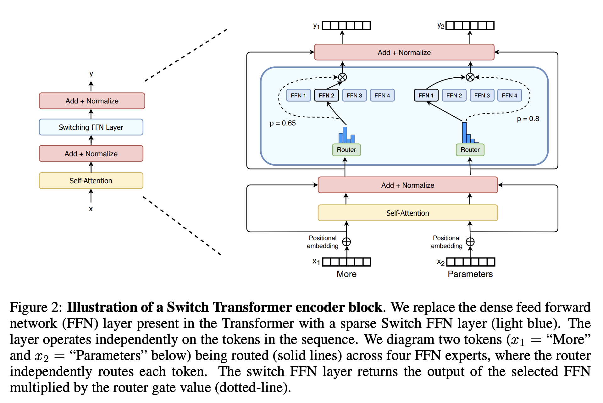

[](https://discord.gg/qUtxnK2NMf)

# Switch Transformers



Implementation of Switch Transformers from the paper: "Switch Transformers: Scaling to Trillion Parameter Models with Simple and Efficient Sparsity" in PyTorch, Einops, and Zeta. [PAPER LINK](https://arxiv.org/abs/2101.03961)

## Installation

```bash
pip install -e .
```

# Usage
```python
import torch
from switch_transformers import SwitchTransformer

# Generate a random tensor of shape (1, 10) with values between 0 and 100
x = torch.randint(0, 100, (1, 10))

# Create an instance of the SwitchTransformer model
# num_tokens: the number of tokens in the input sequence
# dim: the dimensionality of the model
# heads: the number of attention heads
# dim_head: the dimensionality of each attention head
model = SwitchTransformer(
    num_tokens=100, dim=512, heads=8, dim_head=64
)

# Pass the input tensor through the model
out = model(x)

# Print the shape of the output tensor
print(out.shape)


```


## Citation
```bibtex
@misc{fedus2022switch,
    title={Switch Transformers: Scaling to Trillion Parameter Models with Simple and Efficient Sparsity}, 
    author={William Fedus and Barret Zoph and Noam Shazeer},
    year={2022},
    eprint={2101.03961},
    archivePrefix={arXiv},
    primaryClass={cs.LG}
}

```

# License
MIT
